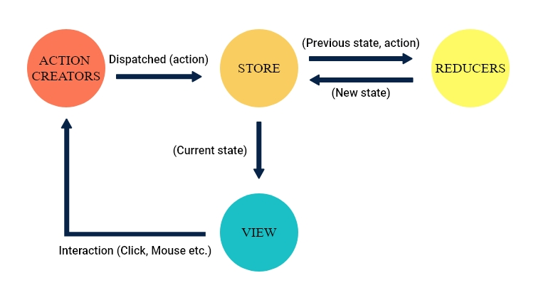

# redux

*Redux is a predictable state container for JavaScript apps.

It helps you write applications that behave consistently, run in different environments (client, server, and native), and are easy to test. *

*Redux 是一个状态容器，独立于app之外有自己的环境*

## Install： 

library for use redux in react
`npm install react-redux`

redux library 
`npm install redux`

## Redux data flow 

